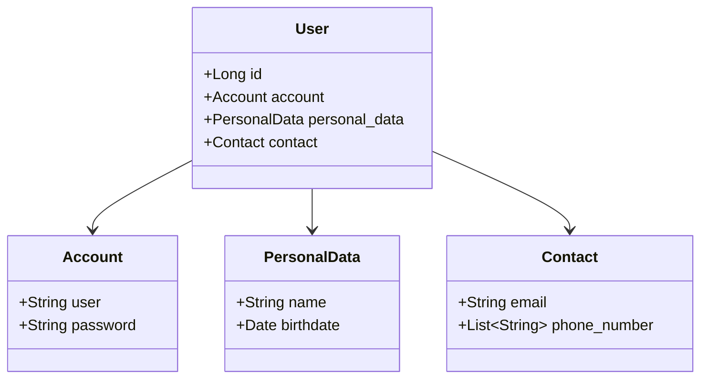
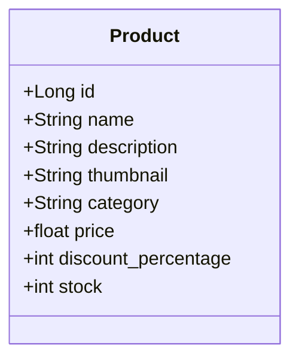
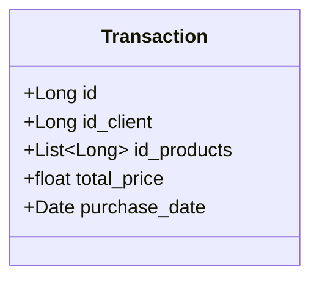

# Publicando Sua API REST na Nuvem Usando Spring Boot 3, Java 17 e Railway
Repositório do lab "Publicando Sua API REST na Nuvem Usando Spring Boot 3, Java 17 e Railway" da Digital Innovation One.

## Projeto
Implementação de um sistema de webstore para compras online. 
Armazenamento de dados de usuário, produtos disponíveis e log de compras/transações.

